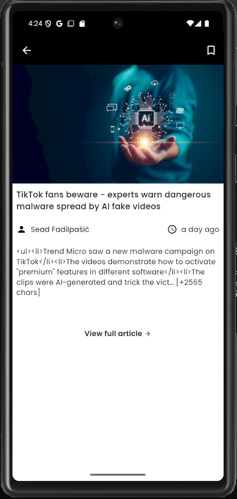
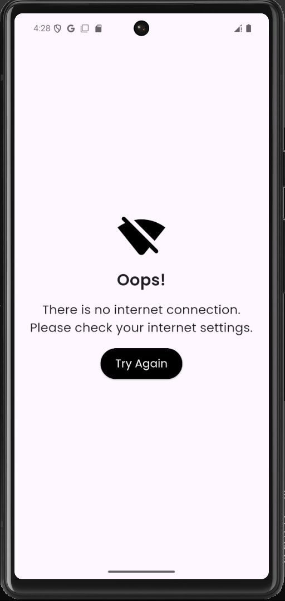

# Flutter News App

A simple yet feature-rich news application built using **Flutter**. This app fetches real-time news data from the News API . It includes features such as **search functionality** and a **bookmark system using Provider**.

---

## Features

- Fetches live news data using NewsAPI.org

- Search functionality to filter articles by keyword

- Bookmark your favorite articles (using Provider for state management)

- Modern UI built with Flutter

---

## Screenshots







---

## Getting Started:

### Steps to Run the App

1. Clone the Repository

```bash
git clone https://github.com/Dilshan97/Flutter-news-app 
```

2. Install Dependencies

Navigate into the project directory and run:

```bash
flutter pub get
```

3. Set Up the News API

Visit https://newsapi.org and sign up for a free account.

After logging in, generate your API key.

Locate the .env file in the assets/ directory.

Replace the placeholder with your actual API key: NEWS_API_KEY = your_actual_api_key

---

## Acknowledgment

This app is based on the open-source project by [@Dilshan97](https://github.com/Dilshan97):

[Original GitHub Repository](https://github.com/Dilshan97/Flutter-news-app)

---


